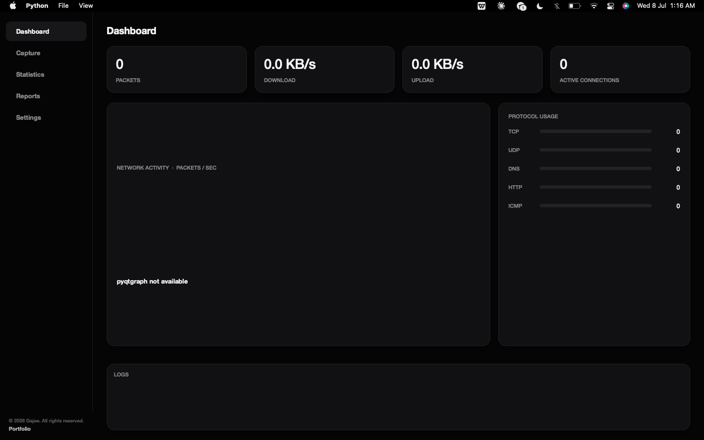
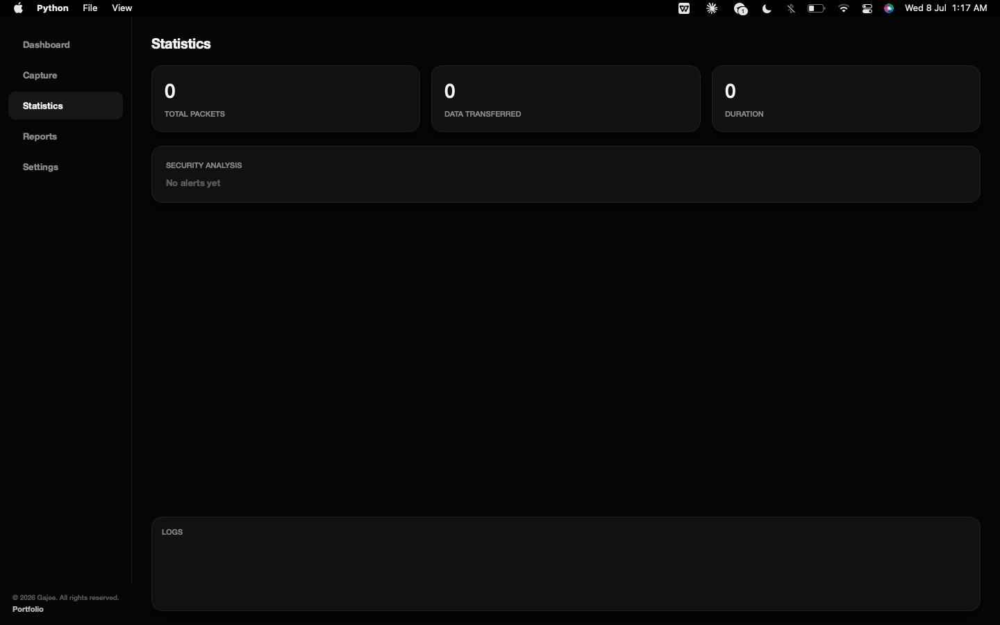

# NetScope

A lightweight network packet analyzer inspired by Wireshark, designed for learning networking, cybersecurity, and packet analysis. NetScope provides real-time packet capture with a minimal black-and-white desktop interface while remaining easy to understand and extend.

> NetScope captures only traffic visible to the network interfaces of the computer it is running on. It is intended for educational purposes and should only be used on systems and networks you own or are authorized to inspect.

---

## Screenshots

### Dashboard



### Packet Analyzer



---

## Features

### Live Monitoring

- Real-time packet capture
- Packets per second
- Network throughput estimation
- Active connections
- Live protocol statistics

### Protocol Support

- TCP
- UDP
- DNS
- HTTP
- ICMP
- IPv4

### Packet Inspection

- Packet table
- Live filtering
- Ethernet headers
- IP headers
- TCP/UDP details
- HTTP request parsing
- Packet detail panel

### Capture Controls

- Start
- Pause
- Stop
- Clear session

### Storage

- SQLite packet database
- Automatic session logging
- JSON export
- Report generation

### Security Heuristics

- ICMP flood detection
- DNS burst detection
- Failed connection monitoring

### Settings

- Default network interface
- Startup capture
- Export directory
- Application preferences

---

## Project Structure

```text
NetScope/
├── capture/
│   ├── protocols.py
│   └── sniffer.py
├── database/
│   └── storage.py
├── ui/
│   ├── dashboard.py
│   ├── main_window.py
│   ├── packets.py
│   ├── settings.py
│   ├── stats_reports.py
│   └── theme.py
├── assets/
├── exports/
├── main.py
├── requirements.txt
├── ui1.jpeg
├── ui2.jpeg
└── README.md
```

---

## Installation

Clone the repository.

```bash
git clone https://github.com/USERNAME/NetScope.git
cd NetScope
```

Create a virtual environment.

```bash
python -m venv venv
```

Activate it.

**Windows**

```bash
venv\Scripts\activate
```

**macOS / Linux**

```bash
source venv/bin/activate
```

Install dependencies.

```bash
pip install -r requirements.txt
```

---

## Windows

Install **Npcap** with **WinPcap API-compatible Mode** enabled before capturing packets.

---

## macOS / Linux

Packet capture requires elevated privileges.

```bash
sudo python main.py
```

On Linux you can grant the required capabilities once.

```bash
sudo setcap cap_net_raw,cap_net_admin=eip $(readlink -f $(which python3))
```

---

## Running

```bash
python main.py
```

1. Select a network interface.
2. Start packet capture.
3. Filter traffic.
4. Inspect packets.
5. Export reports.

---

## Building

```bash
pip install pyinstaller
pyinstaller --onefile --windowed --name NetScope main.py
```

Output binaries are created in the `dist` directory.

---

## Limitations

- HTTPS payloads remain encrypted.
- HTTP parsing is limited to unencrypted HTTP traffic.
- Throughput values are estimated.
- GeoIP lookup is not included.
- Only traffic visible to the local machine can be captured.

---

## Roadmap

- PCAP import/export
- IPv6 support
- GeoIP integration
- Process-to-connection mapping
- Packet search history
- Improved statistics
- Plugin support

---

## License

MIT License.
